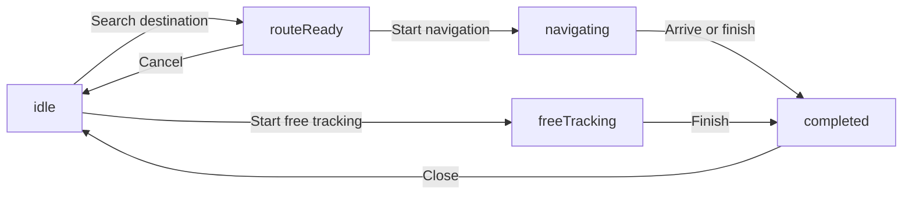

## Overview

My Auto Guide implements a **complete GPS navigation system** using 100% free and open-source technologies:

- **OpenStreetMap**: Free map tiles with CartoDB Voyager styling
- **Nominatim API**: Geocoding and reverse geocoding (address search)
- **OSRM**: Open Source Routing Machine for optimal route calculation
- **flutter_map**: Interactive map widget for Flutter
- **Geolocator**: Real-time GPS position tracking

This creates a navigation experience similar to Waze or Google Maps, without any API costs.

---

## Dependencies

Add these packages to `pubspec.yaml`:

```yaml
dependencies:
  flutter_map: ^6.0.0
  latlong2: ^0.9.0
  geolocator: ^10.0.0
  http: ^1.1.0
```

---

## Map Display

### FlutterMap Widget

The interactive map is rendered using the `flutter_map` package:

```dart
// lib/rutas_screen.dart:444-536
FlutterMap(
  mapController: _mapCtrl,
  options: MapOptions(
    initialCenter: _currentPos!, // LatLng of current position
    initialZoom: 15,
  ),
  children: [
    // 1. Base map tiles from OpenStreetMap
    TileLayer(
      urlTemplate: 'https://basemaps.cartocdn.com/rastertiles/voyager/{z}/{x}/{y}@2x.png',
      userAgentPackageName: 'com.example.my_auto_guide',
    ),
    
    // 2. Route polyline (blue line)
    if (_routePoints.isNotEmpty)
      PolylineLayer(
        polylines: [
          Polyline(
            points: _routePoints,
            strokeWidth: 5,
            color: Colors.blue.withOpacity(0.6),
          ),
        ],
      ),
    
    // 3. Travelled path (green line)
    if (_travelledPoints.length > 1)
      PolylineLayer(
        polylines: [
          Polyline(
            points: _travelledPoints,
            strokeWidth: 6,
            color: Colors.green,
          ),
        ],
      ),
    
    // 4. Markers for current position and destination
    MarkerLayer(
      markers: [
        // Current position (blue circle)
        Marker(
          point: _currentPos!,
          width: 50,
          height: 50,
          child: Container(
            decoration: BoxDecoration(
              shape: BoxShape.circle,
              color: Colors.blue,
              border: Border.all(color: Colors.white, width: 3),
            ),
            child: const Icon(
              Icons.navigation,
              color: Colors.white,
              size: 22,
            ),
          ),
        ),
        
        // Destination (red flag)
        if (_destination != null)
          Marker(
            point: _destination!,
            width: 50,
            height: 50,
            child: Container(
              decoration: BoxDecoration(
                shape: BoxShape.circle,
                color: Colors.redAccent,
                border: Border.all(color: Colors.white, width: 3),
              ),
              child: const Icon(Icons.flag, color: Colors.white, size: 22),
            ),
          ),
      ],
    ),
  ],
)
```

### Map Tiles

We use **CartoDB Voyager** tiles for high-quality rendering:

```
https://basemaps.cartocdn.com/rastertiles/voyager/{z}/{x}/{y}@2x.png
```

**Alternative tile providers:**
- OpenStreetMap Standard: `https://tile.openstreetmap.org/{z}/{x}/{y}.png`
- CartoDB Dark Matter: `https://basemaps.cartocdn.com/dark_all/{z}/{x}/{y}@2x.png`
- CartoDB Positron: `https://basemaps.cartocdn.com/light_all/{z}/{x}/{y}@2x.png`

### Map Controller

Control map camera programmatically:

```dart
final MapController _mapCtrl = MapController();

// Move to specific location
_mapCtrl.move(LatLng(lat, lon), 15); // zoom level 15

// Fit bounds to show entire route
final bounds = LatLngBounds.fromPoints([_currentPos!, _destination!]);
_mapCtrl.fitCamera(
  CameraFit.bounds(
    bounds: bounds,
    padding: const EdgeInsets.all(60),
  ),
);
```

---

## GPS Location Tracking

### Request Permissions

```dart
// lib/rutas_screen.dart:108-147
Future<void> _obtenerUbicacion() async {
  // 1. Check if GPS is enabled
  bool serviceEnabled = await Geolocator.isLocationServiceEnabled();
  if (!serviceEnabled) {
    ScaffoldMessenger.of(context).showSnackBar(
      const SnackBar(content: Text('Activa el GPS para usar Rutas')),
    );
    return;
  }

  // 2. Check permission status
  LocationPermission permission = await Geolocator.checkPermission();
  if (permission == LocationPermission.denied) {
    permission = await Geolocator.requestPermission();
    if (permission == LocationPermission.denied) {
      ScaffoldMessenger.of(context).showSnackBar(
        const SnackBar(content: Text('Permiso de ubicación denegado')),
      );
      return;
    }
  }
  
  if (permission == LocationPermission.deniedForever) {
    ScaffoldMessenger.of(context).showSnackBar(
      const SnackBar(
        content: Text('Permiso de ubicación denegado permanentemente'),
      ),
    );
    return;
  }

  // 3. Get current position
  final pos = await Geolocator.getCurrentPosition(
    desiredAccuracy: LocationAccuracy.high,
  );
  
  setState(() {
    _currentPos = LatLng(pos.latitude, pos.longitude);
  });
  
  // 4. Center map on current position
  _mapCtrl.move(_currentPos!, 15);
}
```

### Stream Position Updates

For real-time navigation, listen to continuous position updates:

```dart
// lib/rutas_screen.dart:256-289
const locationSettings = LocationSettings(
  accuracy: LocationAccuracy.high,
  distanceFilter: 5, // Update every 5 meters
);

_posStream = Geolocator.getPositionStream(
  locationSettings: locationSettings,
).listen((pos) {
  final newPos = LatLng(pos.latitude, pos.longitude);
  final lastPos = _travelledPoints.last;

  // Calculate distance travelled in this segment
  const distance = Distance();
  final segmentMeters = distance.as(LengthUnit.Meter, lastPos, newPos);
  final segmentKm = segmentMeters / 1000.0;

  setState(() {
    _currentPos = newPos;
    _travelledPoints.add(newPos);
    _travelledDistanceKm += segmentKm;
  });

  // Center map on current position
  _mapCtrl.move(newPos, _mapCtrl.camera.zoom);

  // Check if arrived at destination (within 50 meters)
  if (_destination != null) {
    final distToEnd = distance.as(LengthUnit.Meter, newPos, _destination!);
    if (distToEnd < 50) {
      _completarRuta(); // Finish navigation
    }
  }
});
```

**Distance Calculation:**

Use the `latlong2` package's `Distance` class:

```dart
const distance = Distance();
final meters = distance.as(LengthUnit.Meter, point1, point2);
final kilometers = meters / 1000.0;
```

---

## Nominatim Geocoding

**Nominatim** is OpenStreetMap's geocoding service for searching locations.

### Search Places

```dart
// lib/rutas_screen.dart:150-176
Future<void> _buscarDestino(String query) async {
  if (query.trim().isEmpty) {
    setState(() => _searchResults = []);
    return;
  }
  
  setState(() => _isSearching = true);
  
  try {
    final url = Uri.parse(
      'https://nominatim.openstreetmap.org/search'
      '?q=${Uri.encodeComponent(query)}'
      '&format=json&limit=5&addressdetails=1',
    );
    
    final res = await http.get(url, headers: {
      'User-Agent': 'MyAutoGuide/1.0', // Required by Nominatim
    });
    
    if (res.statusCode == 200) {
      final data = json.decode(res.body) as List;
      setState(() {
        _searchResults = data.map((e) => e as Map<String, dynamic>).toList();
      });
    }
  } catch (_) {
    // Handle error silently
  } finally {
    if (mounted) setState(() => _isSearching = false);
  }
}
```

### API Parameters

- `q`: Search query (URL encoded)
- `format=json`: Return JSON response
- `limit=5`: Maximum 5 results
- `addressdetails=1`: Include detailed address components

### Response Format

```json
[
  {
    "place_id": 123456,
    "lat": "4.6097100",
    "lon": "-74.0817500",
    "display_name": "Bogotá, Colombia",
    "address": {
      "city": "Bogotá",
      "country": "Colombia"
    }
  }
]
```

### Parse and Display Results

```dart
// lib/rutas_screen.dart:178-190
void _seleccionarDestino(Map<String, dynamic> place) {
  final lat = double.parse(place['lat']);
  final lon = double.parse(place['lon']);
  
  setState(() {
    _destination = LatLng(lat, lon);
    _destinationName = place['display_name'] ?? 'Destino';
    _searchResults = [];
    _searchCtrl.text = _destinationName;
  });
  
  _trazarRuta(); // Calculate route
}
```

---

## OSRM Route Calculation

**OSRM** (Open Source Routing Machine) calculates optimal driving routes.

### Request Route

```dart
// lib/rutas_screen.dart:193-241
Future<void> _trazarRuta() async {
  if (_currentPos == null || _destination == null) return;
  
  setState(() => _isLoadingRoute = true);
  
  try {
    final url = Uri.parse(
      'https://router.project-osrm.org/route/v1/driving/'
      '${_currentPos!.longitude},${_currentPos!.latitude};'
      '${_destination!.longitude},${_destination!.latitude}'
      '?overview=full&geometries=geojson&steps=true',
    );
    
    final res = await http.get(url);
    
    if (res.statusCode == 200) {
      final data = json.decode(res.body);
      final route = data['routes'][0];
      
      // Extract route geometry
      final coords = route['geometry']['coordinates'] as List;
      final points = coords
          .map((c) => LatLng(
                (c[1] as num).toDouble(), // latitude
                (c[0] as num).toDouble(), // longitude
              ))
          .toList();
      
      // Extract distance and duration
      final distMeters = (route['distance'] as num).toDouble();
      final durSeconds = (route['duration'] as num).toDouble();
      
      setState(() {
        _routePoints = points;
        _routeDistanceKm = distMeters / 1000;
        _routeDurationMin = durSeconds / 60;
        _state = _RouteState.routeReady;
        _isLoadingRoute = false;
      });
      
      // Fit map to show entire route
      final bounds = LatLngBounds.fromPoints([_currentPos!, _destination!]);
      _mapCtrl.fitCamera(
        CameraFit.bounds(
          bounds: bounds,
          padding: const EdgeInsets.all(60),
        ),
      );
    }
  } catch (e) {
    setState(() => _isLoadingRoute = false);
  }
}
```

### API Parameters

- **Profile**: `driving`, `walking`, or `cycling`
- **Coordinates**: `{lon},{lat};{lon},{lat}`
- **Query parameters**:
  - `overview=full`: Return full route geometry
  - `geometries=geojson`: Use GeoJSON format
  - `steps=true`: Include turn-by-turn instructions

### Response Format

```json
{
  "routes": [
    {
      "distance": 12345.6,  // meters
      "duration": 789.1,    // seconds
      "geometry": {
        "coordinates": [
          [-74.0817, 4.6097],  // [lon, lat]
          [-74.0820, 4.6100],
          // ...
        ]
      },
      "legs": [...]
    }
  ]
}
```

---

## Navigation States

The app uses a state machine to manage navigation flow:

```dart
enum _RouteState {
  idle,         // No destination selected
  routeReady,   // Route calculated, ready to start
  navigating,   // Active navigation with destination
  freeTracking, // GPS tracking without destination
  completed,    // Navigation finished
}
```

### State Transitions



---

## Free Tracking Mode

Users can track distance **without a destination**:

```dart
// lib/rutas_screen.dart:421-424
void _iniciarRecorridoLibre() {
  if (_currentPos == null) return;
  _iniciarNavegacion(isFree: true);
}
```

In this mode:
- No route is calculated
- GPS tracks position continuously
- Distance is accumulated and added to vehicle kilometrage
- Green polyline shows the path travelled

---

## Updating Kilometrage

When navigation completes, the travelled distance is added to the vehicle's kilometrage:

```dart
// lib/rutas_screen.dart:293-375
Future<void> _completarRuta() async {
  _posStream?.cancel();
  
  final kmsRecorridos = _travelledDistanceKm;
  
  // Get latest km from database
  int kmsBase = widget.kmsActuales;
  try {
    final data = await supabase
        .from('vehiculos')
        .select('kms')
        .eq('id', widget.vehiculoId)
        .single();
    kmsBase = data['kms'] as int;
  } catch (_) {
    // Fallback to initial value
  }
  
  final nuevoKm = kmsBase + kmsRecorridos.round();
  
  // Update in database
  await supabase
      .from('vehiculos')
      .update({'kms': nuevoKm})
      .eq('id', widget.vehiculoId);
  
  setState(() => _state = _RouteState.completed);
  
  // Show completion dialog
  showDialog(
    context: context,
    builder: (ctx) => AlertDialog(
      title: const Text('¡Ruta completada!'),
      content: Column(
        mainAxisSize: MainAxisSize.min,
        children: [
          _InfoRow(
            icon: Icons.straighten,
            label: 'Distancia recorrida',
            value: '${kmsRecorridos.toStringAsFixed(1)} km',
          ),
          _InfoRow(
            icon: Icons.speed,
            label: 'Nuevo kilometraje',
            value: '${nuevoKm.round()} km',
          ),
        ],
      ),
    ),
  );
}
```

---

## Best Practices

### 1. Always Set User-Agent for Nominatim

Nominatim requires a custom User-Agent:

```dart
headers: {
  'User-Agent': 'MyAutoGuide/1.0',
}
```

### 2. Limit API Requests

- Debounce search queries (wait 300ms after typing stops)
- Cache route calculations
- Respect API rate limits (1 request/second for Nominatim)

### 3. Handle Network Errors Gracefully

```dart
try {
  final res = await http.get(url);
  if (res.statusCode == 200) {
    // Process response
  }
} catch (e) {
  if (mounted) {
    ScaffoldMessenger.of(context).showSnackBar(
      SnackBar(content: Text('Error: $e')),
    );
  }
}
```

### 4. Cancel Position Stream on Dispose

```dart
StreamSubscription<Position>? _posStream;

@override
void dispose() {
  _posStream?.cancel();
  super.dispose();
}
```

### 5. Optimize Polyline Rendering

For long routes, consider simplifying the polyline to reduce rendering load:

```dart
// Keep only every Nth point for display
final simplifiedRoute = _routePoints
    .where((point) => _routePoints.indexOf(point) % 5 == 0)
    .toList();
```

---

## Performance Tips

### Battery Optimization

- Use `distanceFilter: 5` to avoid excessive updates
- Reduce `LocationAccuracy` to `medium` for longer trips
- Stop position stream when app is in background

### Map Rendering

- Limit polyline points for very long routes
- Use `userAgentPackageName` in TileLayer for proper caching
- Consider offline map tiles for areas with poor connectivity

---

## Related Files

- **Main Navigation**: `lib/rutas_screen.dart`
- **Map Configuration**: `lib/rutas_screen.dart:444-536`
- **GPS Tracking**: `lib/rutas_screen.dart:108-147`
- **Geocoding**: `lib/rutas_screen.dart:150-176`
- **Route Calculation**: `lib/rutas_screen.dart:193-241`

---

## Additional Resources

- [flutter_map Documentation](https://docs.fleaflet.dev/)
- [Nominatim API](https://nominatim.org/release-docs/develop/api/Search/)
- [OSRM API Documentation](http://project-osrm.org/docs/v5.24.0/api/)
- [Geolocator Plugin](https://pub.dev/packages/geolocator)
- [OpenStreetMap Tile Servers](https://wiki.openstreetmap.org/wiki/Tile_servers)